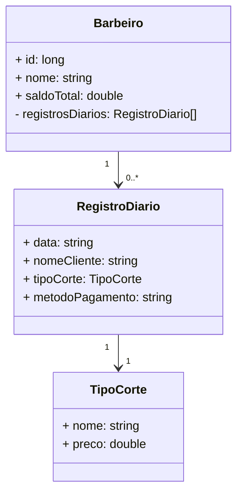

# Bootcamp Santander DIO
Java RESTful criada para o Bootcamp do Santander.

Este projeto é uma API criada para permitir que cabeleireiros registrem os cortes realizados diariamente, proporcionando um registro detalhado de seu trabalho.

Inicialmente está bem simples e há muitas melhorias que devem ser feitas, como a implementação da automação do saldo total, adicionando automaticamente o valor de cada corte registrado a partir de uma tabela existente de nomes e preços de cortes, entre outras diversas melhorias. 

Tentei fazer o mais simples possivel para conseguir entender melhor como fazer a aplicação.

## Diagrama de Classe

